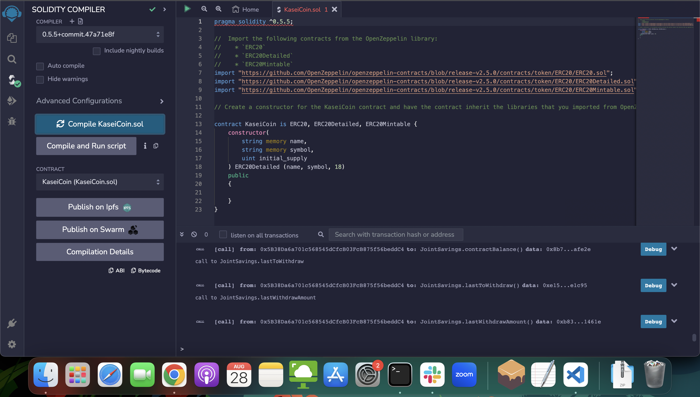
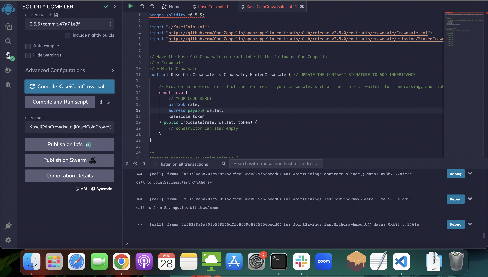

# Module-21-Challenge

This repo contains solidity contracts that launch a token called KaseiCoin as well as a linked Crowdsale minting contract for users to purchase and mint KaseiCoin

## Evaluation Evidence

Compilation of the KaseiCoin token:

Compilation of the KaseiCoinCrowdsale contract:

Compilation of KaseiCrowdsaleDeployable contract:

Deployment of contract:

